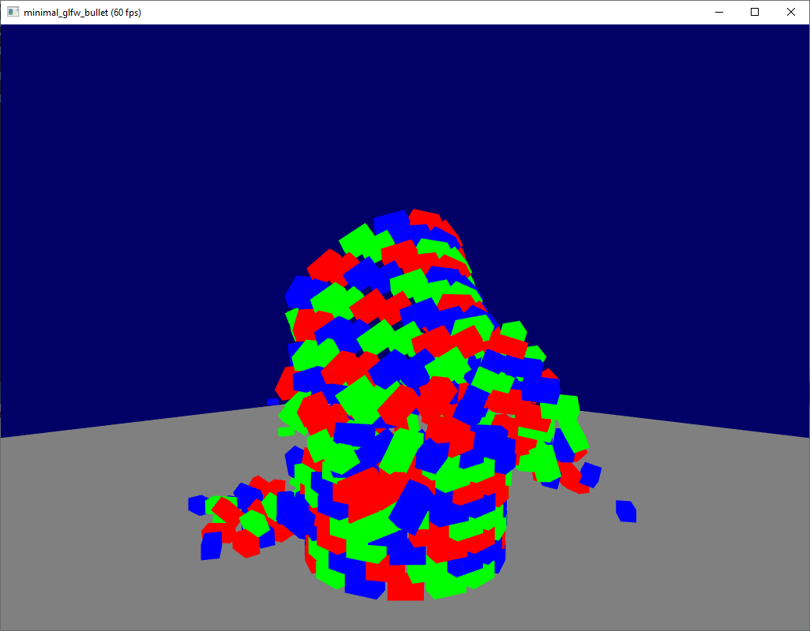

# Minimal GLFW Bullet Sample

## Description
minimal Bullet sample with CMake, GLFW, GLEW and GLM - project dependencies are included

## Build Instructions for VS2019
1. configure and generate CMake Bullet Physics project for VS2019 x64 (BULLET_PHYSICS.sln)
  * cmake .. -DCMAKE_INSTALL_PREFIX=./install
  * build BULLET_PHYSICS.sln (Developer Command Prompt for VS 2019)
    * MSBuild INSTALL.vcxproj /property:Configuration=Debug
    * MSBuild INSTALL.vcxproj /property:Configuration=Release
2. set custom BULLET_ROOT variable in minimal_glfw_bullet/src CMake file (line 28)
3. generate minimal_glfw_bullet project with CMake
  * set glm_DIR to your local glm
  * configure & generate
4. build & run minimal_glfw_bullet from VS2019

## References
 * [opengl-tutorial.org - Tutorial 6 : Keyboard and Mouse](http://www.opengl-tutorial.org/beginners-tutorials/tutorial-6-keyboard-and-mouse/)
